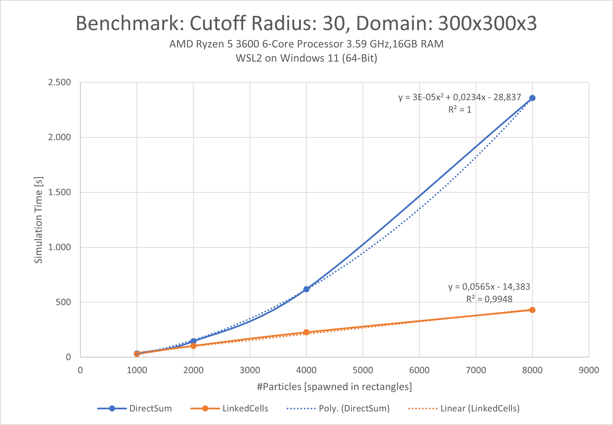
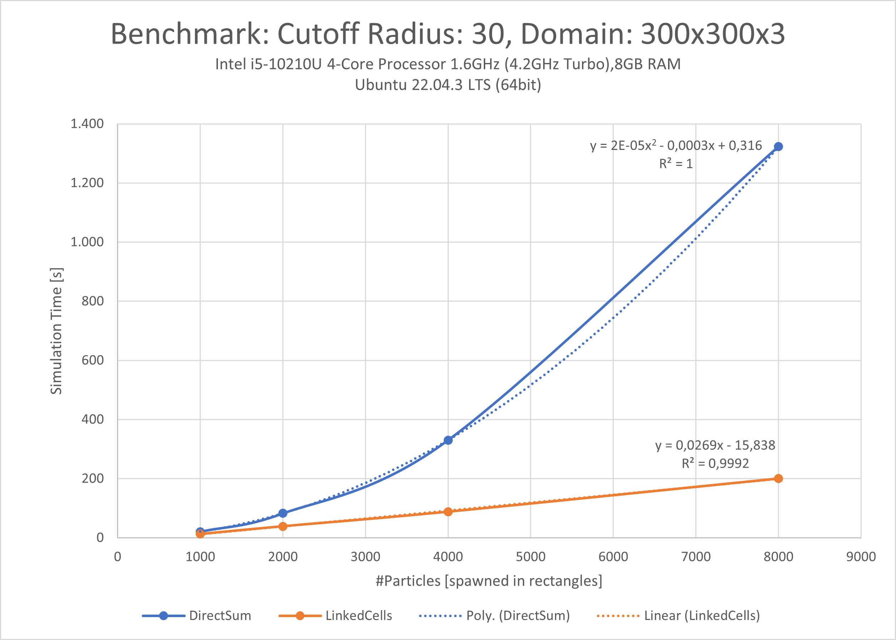
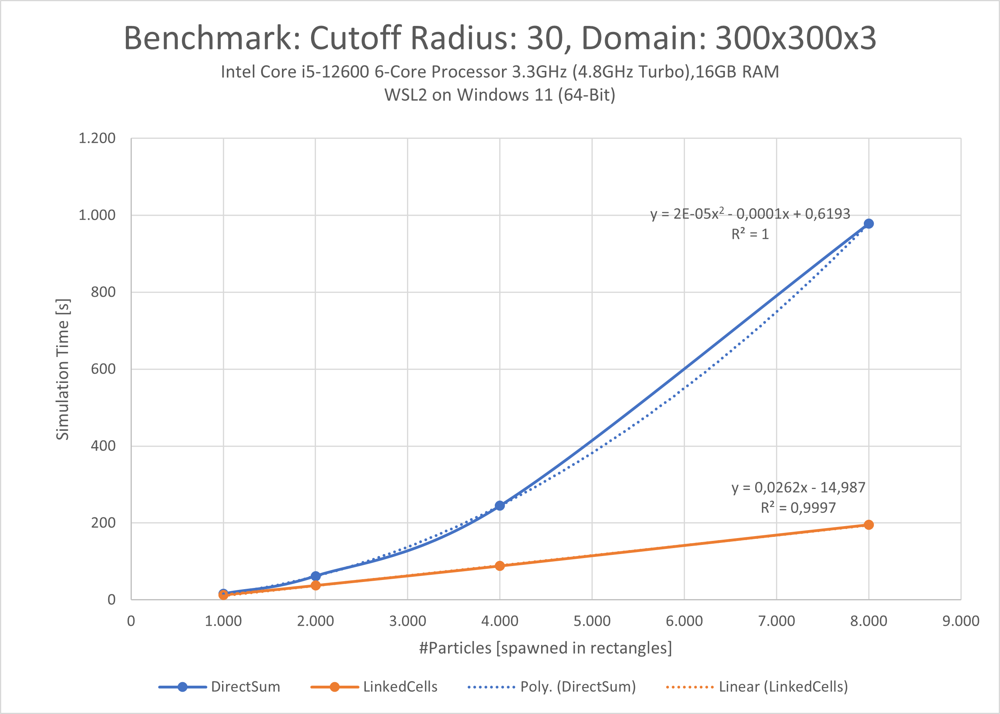
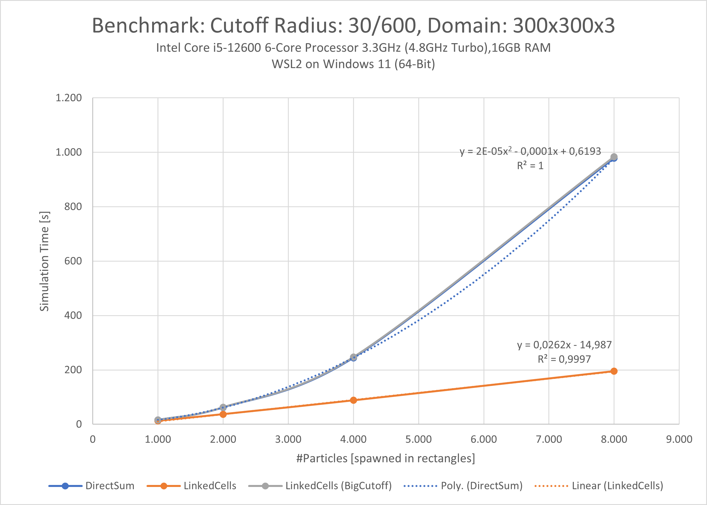

# Sheet <TODO>: Team C

Members of **Team C**:

* Manuel Lerchner
* Tobias Eppacher
* Daniel Safyan

## Code

* Link:     <https://github.com/ManuelLerchner/MolSim-WS23-24>
* Branch:   master
* Revision: fa19de9fd1de4384a8bedf192d6852e0c304ad7a
* Compiler: gcc 13.1.0 (But should work for most up to date compilers)

## Report

### Task 1: XML-Input

1. **Create a schema**
    - We created a schema for the input format, which you can find in 'input/simulation.xsd'
    - It was pretty straight forward and the most important thing was to make sure to not forget any parameter
    - Then with the help of the xsd-compiler we quickly had our xml-parser
    
2. **Create adapters for different elements**
    - we continue to use the adapter pattern to avoid complex code and to have all value verifications in one place
    - example: you have parsed a xsd-cuboid and can convert it to a cuboid spawner

### Task 2: Linked-Cell-Algorithm

1. **Data structure**
    - We used two major data structures to store internal data: one vector for all particles and one vector for all cells
    - We then gave the Linked-Cells-Container a way to iterate over all particles, boundary cells, halo cells, occupied cells ..., by creating helper vectors that hold pointers to the corresponding particles/cells in the main vectors
    - The reason we did this is that it enables us to optimize our code a lot, as vectors are very cache friendly and we can iterate over them in a very efficient way, while still being quite memory efficient as the helper vectors only hold pointers
    - An example for such an optimization would be the prevention of iteration over empty cells

2. **Force calculation**
   - The force calculation is a nested loop over cells
   - Then we calculate the force and reaction force in the cell itself
   - Then we consider the interactions between our cell and its neighbours (every cell has a vector containing pointers to all neighboring cells)
   - Since the cutoff radius is fixed and the cell size based on it, the maximum number of neighbour cells is fixed and the references can be calculated before the simulation starts

3. **Optimizations**
    - We already made use of Newtons third law in the force calculation inside of a cell
and now we use it to optimize force calculation between cells
    - The problem was that if we implement it naively we end up adding the same force
interaction multiple times for between two cells
    - So to avoid that each cell holds references of all cells that already influenced it
    - This way we can use Newtons law and just skip a cell later in the calculations if it has already affected the current one

4. **Observations of the simulation**
   - We reran the simulation from last week and the results at least on a macro scale did not change much 
   - Using some tests, we compared the results of the direct sum container and the linked cells container and they were the essentially the same if cutoff radius was big enough
   - With a too low cutoff radius or simulated for a too long time the results started to deviate, but that is to be expected, as the direct sum container captures interactions on all particles, no matter how far apart they are, which the linked cells container does not by definition of the cutoff radius.
   - 
5. **Benchmarks**
   - We automized the benchmarking process
   - You now only have to make the binary in /benchmarks and the script will genrate a csv file that you can then
analyze
   - The exact measurements can be found in the data folder but it is visible how the running time of the direct sum container
grows nearly quadratically and while the time of the linked cells container grows almost linearly
   - The reason for the linked cells container to still show a slight touch of quadratic growth is that within a single cell, the force calculation still follows the direct sum approach
   - This means, that if the cutoff radius is big enough, the full domain becomes a single cell and the linked cells container will behave like the direct sum container (quadratic running time)

### Task 3: Boundary conditions

To handle boundary conditions we needed new input for the construction of our linked cells container. Since the user should be able to specify the boundary condition for every side of the domain, we now ask for a array of six boundary condition types where each entry corresponds to one side of the domain.
We then needed to implement the different boundary conditions.

1. **Outflow Boundaries**
   - The outflow boundaries were pretty quick to implement
   - Since we have to update the cells and their particle lists anyway, we check the halo cells after every loop
and delete all particles that they hold (this was our approach from the beginning since no particle should exist outside the domain)

2. **Reflective Boundaries**
   - The reflective boundaries were a bit more tricky
   - We figured that the idea to save halo particle for every particle close to the boundary would be memory and runtime inefficient and complicated to implement 
with our existing code base
   - We went for a different approach: Every time a particle comes too close to a reflective boundary in our simulation, we create a hypothetical particle
that helps us calculate the repelling force from the reflective boundary. But we do not save it. It only exists in the scope of the force calculation and is deleted immediately afterwards.
   - This way our particle vector stays clean and is not littered with halo particles that need to be removed later anyways

### Task 4: Simulation of a falling drop - Wall
1. **Generate sphere**
    - The sphere spawner is basically a cube spawner that only adds those particles that have the right distance from the center
    - Simply some geometry

2. **Observations of the simulation**
    - The simulation should have looked like a water drop thrown at a surface in space and that is looks like
    - The sphere is deformed at first and then gives this "Deformation Energy" back and scattering in all direction with 
high velocity
    - All of this seems very physically realistic to us so we were very happy with the results :)
### Misc

- During this sheet we found a way to incorporate ray tracing in paraview making 3D Simulations prettier and easier to follow 
- This was important to us during these tasks to check the validity of our simulations in all dimensions and with all boundary conditions
